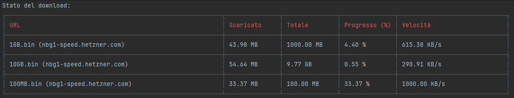

# Node List Downloader

**Node List Downloader** è un semplice tool che permette di scaricare una lista di file a partire da una lista di link fornita. Il tutto è gestito tramite Docker per una configurazione rapida e senza complicazioni.




## Languages / Lingue / Langues

- [English](#english)
- [Italiano](#italiano)
- [Français](#français)

---

## English

**Node List Downloader** is a simple tool that allows you to download a list of files from a provided list of links. Everything is managed via Docker for quick and hassle-free configuration.

### Requirements

- Docker installed on your system.
- A list of links to download, saved in a text file (e.g., `downloads.txt`).

### Configuration

1. Create a file named `downloads.txt` (or another name of your choice) containing the links to download, one per line. Example:

   ```
   https://example.com/file1.zip
   https://example.com/file2.zip
   https://example.com/file3.zip
   ```

2. Prepare a directory where you want the downloaded files to be saved, e.g., `/path/to/output`.

### Usage

1. Run the Docker command to start the container:

   ```bash
   docker run \
       -v /path/to/output:/opt/output \
       -v /path/to/downloads.txt:/opt/config/downloads.txt \
       blacksoulgem95/node-list-downloader
   ```

    - **`/path/to/output`**: The path to the directory on your system where the downloaded files will be saved.
    - **`/path/to/downloads.txt`**: The path to the file containing the links to download.

2. The tool will automatically read the links from `/opt/config/downloads.txt` and download the files into the `/opt/output` directory.

### Volume Structure

- **`/opt/output`**: Internal directory in the container where the downloaded files will be saved. Must be mounted as an external volume.
- **`/opt/config/downloads.txt`**: Configuration file containing the list of links to download. Must be mounted as an external volume.

### Complete Example

Assuming you have:
- A directory `/home/user/downloads` to save the files.
- A file `/home/user/downloads-list.txt` containing the links.

Run:

```bash
docker run \
    -v /home/user/downloads:/opt/output \
    -v /home/user/downloads-list.txt:/opt/config/downloads.txt \
    blacksoulgem95/node-list-downloader
```

### Notes

- Ensure the provided paths are correct and that the user running Docker has read/write permissions for the specified directories and files.
- The `downloads.txt` file should only contain valid links separated by new lines.

### License

This project is licensed under the MIT License. See the LICENSE file for more details.

---

## Italiano

**Node List Downloader** è un semplice tool che permette di scaricare una lista di file a partire da una lista di link fornita. Il tutto è gestito tramite Docker per una configurazione rapida e senza complicazioni.

### Requisiti

- Docker installato sul sistema.
- Una lista di link da scaricare salvata in un file di testo (es. `downloads.txt`).

### Configurazione

1. Crea un file chiamato `downloads.txt` (o un altro nome a tua scelta) contenente i link da scaricare, uno per riga. Esempio:

   ```
   https://example.com/file1.zip
   https://example.com/file2.zip
   https://example.com/file3.zip
   ```

2. Prepara una directory dove vuoi che i file scaricati vengano salvati. Ad esempio: `/path/to/output`.

### Utilizzo

1. Esegui il comando Docker per avviare il container:

   ```bash
   docker run \
       -v /path/to/output:/opt/output \
       -v /path/to/downloads.txt:/opt/config/downloads.txt \
       blacksoulgem95/node-list-downloader
   ```

    - **`/path/to/output`**: Il percorso della directory sul tuo sistema dove verranno salvati i file scaricati.
    - **`/path/to/downloads.txt`**: Il percorso del file contenente i link dei file da scaricare.

2. Il tool leggerà automaticamente i link da `/opt/config/downloads.txt` e scaricherà i file nella directory `/opt/output`.

### Struttura dei Volumi

- **`/opt/output`**: Directory interna al container dove i file scaricati saranno salvati. Deve essere montata come volume esterno.
- **`/opt/config/downloads.txt`**: File di configurazione contenente la lista di link da scaricare. Deve essere montato come volume esterno.

### Esempio Completo

Supponendo di avere:
- Una directory `/home/user/downloads` per salvare i file.
- Un file `/home/user/downloads-list.txt` contenente i link.

Esegui:

```bash
docker run \
    -v /home/user/downloads:/opt/output \
    -v /home/user/downloads-list.txt:/opt/config/downloads.txt \
    blacksoulgem95/node-list-downloader
```

### Note

- Assicurati che i percorsi forniti siano corretti e che l'utente che esegue Docker abbia i permessi di lettura/scrittura nelle directory e nei file specificati.
- Il file `downloads.txt` deve contenere solo link validi separati da una nuova riga.

### Licenza

Questo progetto è distribuito sotto la licenza MIT. Consulta il file LICENSE per maggiori dettagli.

---

## Français

**Node List Downloader** est un outil simple qui permet de télécharger une liste de fichiers à partir d'une liste de liens fournie. Tout est géré via Docker pour une configuration rapide et sans tracas.

### Prérequis

- Docker installé sur votre système.
- Une liste de liens à télécharger, enregistrée dans un fichier texte (par exemple, `downloads.txt`).

### Configuration

1. Créez un fichier nommé `downloads.txt` (ou un autre nom de votre choix) contenant les liens à télécharger, un par ligne. Exemple :

   ```
   https://example.com/file1.zip
   https://example.com/file2.zip
   https://example.com/file3.zip
   ```

2. Préparez un répertoire où vous souhaitez que les fichiers téléchargés soient enregistrés, par exemple : `/path/to/output`.

### Utilisation

1. Exécutez la commande Docker pour démarrer le conteneur :

   ```bash
   docker run \
       -v /path/to/output:/opt/output \
       -v /path/to/downloads.txt:/opt/config/downloads.txt \
       blacksoulgem95/node-list-downloader
   ```

    - **`/path/to/output`** : Le chemin du répertoire sur votre système où les fichiers téléchargés seront enregistrés.
    - **`/path/to/downloads.txt`** : Le chemin du fichier contenant les liens à télécharger.

2. L'outil lira automatiquement les liens depuis `/opt/config/downloads.txt` et téléchargera les fichiers dans le répertoire `/opt/output`.

### Structure des Volumes

- **`/opt/output`** : Répertoire interne au conteneur où les fichiers téléchargés seront enregistrés. Doit être monté comme un volume externe.
- **`/opt/config/downloads.txt`** : Fichier de configuration contenant la liste des liens à télécharger. Doit être monté comme un volume externe.

### Exemple Complet

En supposant que vous avez :
- Un répertoire `/home/user/downloads` pour enregistrer les fichiers.
- Un fichier `/home/user/downloads-list.txt` contenant les liens.

Exécutez :

```bash
docker run \
    -v /home/user/downloads:/opt/output \
    -v /home/user/downloads-list.txt:/opt/config/downloads.txt \
    blacksoulgem95/node-list-downloader
```

### Notes

- Assurez-vous que les chemins fournis sont corrects et que l'utilisateur exécutant Docker dispose des autorisations de lecture/écriture pour les répertoires et fichiers spécifiés.
- Le fichier `downloads.txt` doit contenir uniquement des liens valides séparés par des lignes vides.

### Licence

Ce projet est sous licence MIT. Consultez le fichier LICENSE pour plus de détails.
